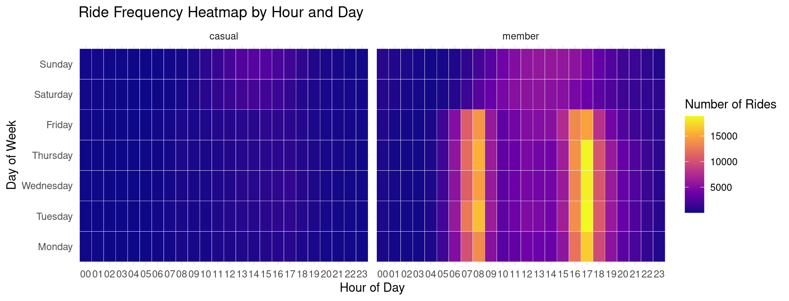
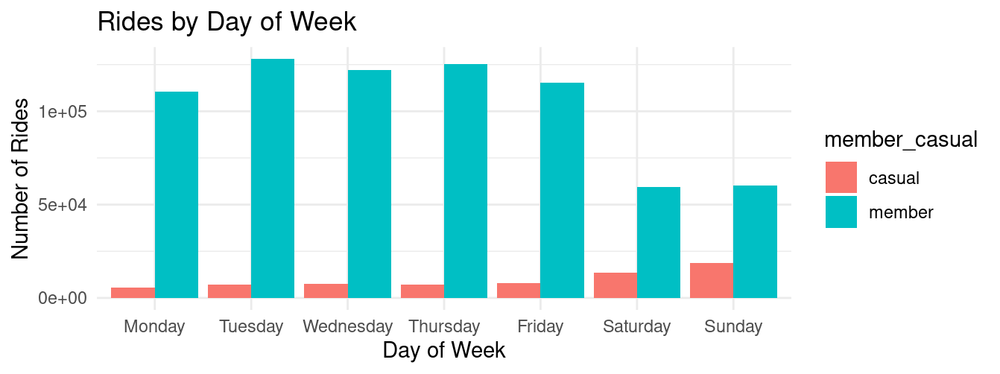
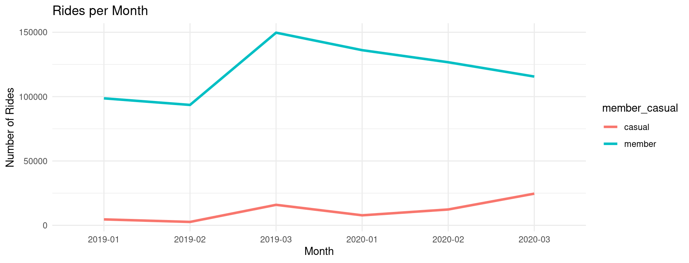
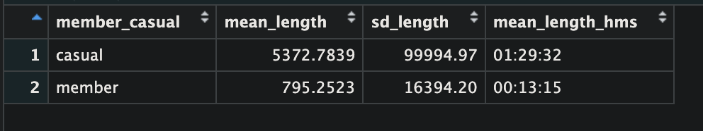
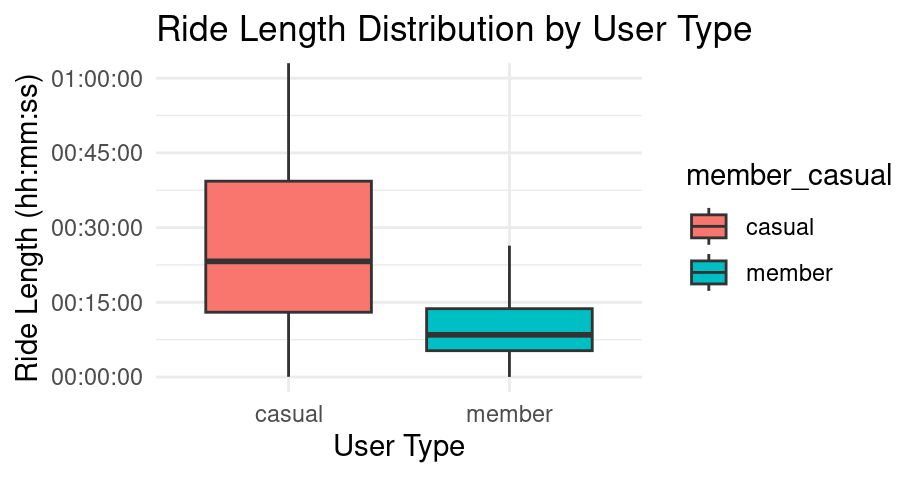

# Cyclistic Case Study: Understanding Rider Behavior
**Author:** Kip Larpenter  
**Date:** 2025-9-19
---
## Overview
This project analyzes Divvy bike share trip data from 2019 and 2020 to answer the question:  
**How do annual members and casual riders use Cyclistic bikes differently?**  
By combining the two datasets, cleaning the data, and creating visualizations, we can draw actionable insights for marketing and operational decisions.
---
## Data Source
- **Source:** [Divvy Trip Data](https://divvy-tripdata.s3.amazonaws.com/index.html)
- **Files:** Divvy_Trips_2019_Q1.csv, Divvy_Trips_2020_Q1.csv  
- **License:** [Data License Agreement](https://divvybikes.com/data-license-agreement)
- **Format:** CSV files  
- **Limitations:** Anonymized data (no demographics), cannot link casual riders across trips
---
## Data Preparation
```r
# Load and combine datasets
df1 <- read.csv("Divvy_Trips_2019_Q1.csv")
df2 <- read.csv("Divvy_Trips_2020_Q1.csv")
df <- bind_rows(df1, df2)

# Standardize rider types
df$member_casual <- recode(df$usertype, Subscriber = "member", Customer = "casual")
```
[See full script here.](scripts/data_cleaning.R)
---
## Visual Analysis
### Ride Frequency Heatmap by Hour and Day

```r
# Create heatmap data
rides_by_hour_day <- df %>%
  group_by(weekday, hour, member_casual) %>%
  tally(name = "rides")

# Generate heatmap
ggplot(rides_by_hour_day, aes(x=hour, y=weekday, fill=rides)) +
  geom_tile(color="white") +
  facet_wrap(~member_casual)
```
[See full script here.](scripts/visualization.R)
### Rides by Day of Week

```r
# Rides by day analysis
by_day <- df %>%
  group_by(weekday, member_casual) %>%
  tally()

ggplot(by_day, aes(x=weekday, y=n, fill=member_casual)) +
  geom_col(position='dodge')
```
[See full script here.](scripts/visualization.R)
### Rides Over Time per Month

```r
# Monthly trend analysis
by_month <- df %>%
  mutate(month = format(date, "%Y-%m")) %>%
  group_by(month, member_casual) %>%
  tally()

ggplot(by_month, aes(x=month, y=n, color=member_casual, group=member_casual)) +
  geom_line(size=1.2)
```
[See full script here.](scripts/visualization.R)
### Mean and SD of Ride Length by User Type

```r
# Calculate summary statistics
summary_tbl <- df %>%
  group_by(member_casual) %>%
  summarize(mean_length = mean(ride_length, na.rm=TRUE),
            sd_length = sd(ride_length, na.rm=TRUE))
```
[See full script here.](scripts/analysis.R)
### Ride Length Distribution by User Type

```r
# Box plot for ride length distribution
ggplot(df, aes(x=member_casual, y=ride_length, fill=member_casual)) +
  geom_boxplot(outlier.shape=NA) +
  coord_cartesian(ylim=c(0, 3600))
```
[See full script here.](scripts/visualization.R)
---
## Key Findings
- **Members:** Predominantly weekday commuters, shorter trips
- **Casual riders:** Weekend/longer leisure trips
- Rider behavior patterns are clear and can guide marketing, promotions, and retention strategies
## Recommendations
1. Promote weekend deals for casual riders → encourage conversion to annual memberships
2. Highlight commuting benefits → build loyalty among existing members  
3. Target marketing by ride length → suggest membership perks for casual riders taking long trips
---
## Conclusion
By analyzing combined trip data from 2019 and 2020, we identified distinct usage patterns between members and casual riders. This analysis provides actionable insights for Cyclistic to improve customer acquisition, retention, and operational planning.
---
## Repository Structure
```
NYC-Cycle/
├── data/         # Raw and sample datasets
├── scripts/      # R scripts for cleaning, analysis, and visualization
├── visuals/      # All images and outputs used in README
├── README.md     # Project overview and results
└── .gitignore    # Exclude large raw data and temp files
```
