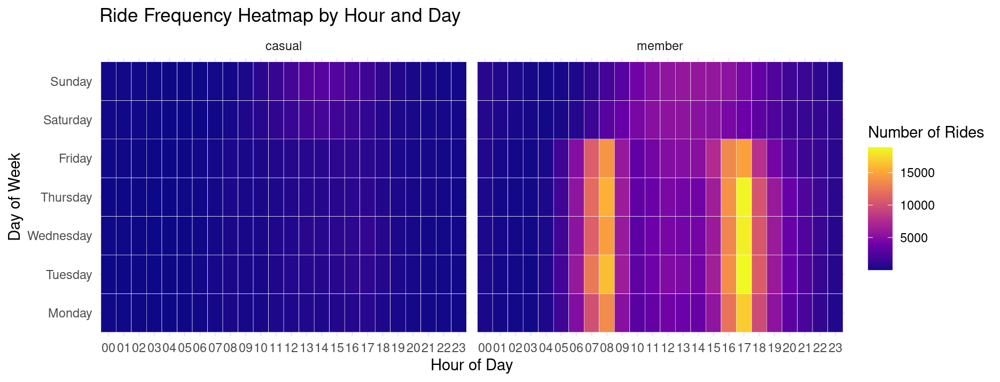
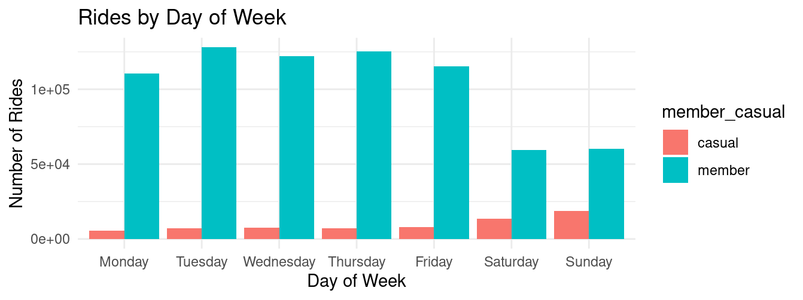
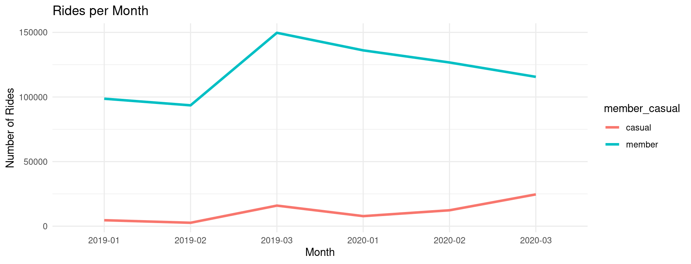
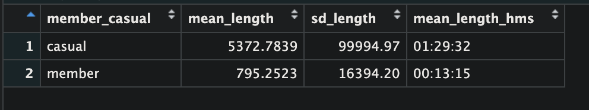
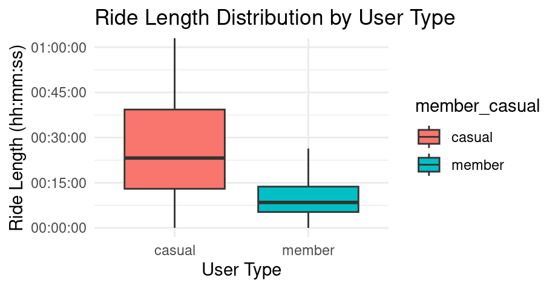

# Cyclistic Case Study – Understanding Rider Behavior

**Author:** Kip Larpenter 
**Date:** 2025-9-18

---

## Overview

This project analyzes Divvy bike share trip data from 2019 and 2020 to answer the question:  

**How do annual members and casual riders use Cyclistic bikes differently?**  

By combining the two datasets, cleaning the data, and creating visualizations, we can draw actionable insights for marketing and operational decisions.

---

## Data Source
- **Source:** [Divvy Trip Data](https://divvy-tripdata.s3.amazonaws.com/index.html)
- **Divvy_Trips_2019_Q1.csv** – raw 2019 trip data  
- **Divvy_Trips_2020_Q1.csv** – raw 2020 trip data  
- **Usage License:**[Data License Agreement] (https://divvybikes.com/data-license-agreement)
- **Timeframe:** Last 12 months  
- **Format:** CSV files  
- **Credibility:** Published by Motivate International Inc. (reliable, public).  
- **Limitations:**  
  - Anonymized data (no demographics).  
  - Cannot link casual riders across trips.  


**Data Preparation Steps:**

1. Loaded both raw CSVs into R.  
2. Combined datasets into a single dataframe.  
3. Standardized rider types:  
   - `Subscriber` → `member`  
   - `Customer` → `casual`  
4. Removed columns not present in both datasets (`start_lat`, `start_lng`, `end_lat`, `end_lng`, `birthyear`, `gender`, `tripduration`).  
5. Saved cleaned dataset as `clean.csv` for analysis.

---

## Analysis & Visualizations

```r
# ============================================================
# Cyclistic Case Study Analysis
# ============================================================

library(tidyverse)
library(lubridate)

# Step 1: Load raw datasets
q1_2019 <- read_csv("data/Divvy_Trips_2019_Q1.csv")
q1_2020 <- read_csv("data/Divvy_Trips_2020_Q1.csv")

# Step 2: Combine & clean
all_trips <- bind_rows(q1_2019, q1_2020) %>%
  mutate(member_casual = recode(member_casual,
                                "Subscriber" = "member",
                                "Customer"   = "casual")) %>%
  select(-any_of(c("start_lat", "start_lng", "end_lat", "end_lng",
                   "birthyear", "gender", "tripduration"))) 

write_csv(all_trips, "data/clean.csv")

#Add in hh:mm:ss format:
df$ride_length_hms <- sprintf('%02d:%02d:%02d',
                              df$ride_length %/% 3600,
                              (df$ride_length %% 3600) %/% 60,
                              df$ride_length %% 60)

# This creates a new column 'ride_length_hms' in my dataframe
head(df[,c("ride_length", "ride_length_hms")])
```
## Visual Analysis

### Ride Frequency Heatmap by Hour and Day


```r
#HeatMap

library(dplyr)
library(ggplot2)

# Extract hour and weekday from your datetime column
df$hour <- format(as.POSIXct(df$started_at), "%H")
df$weekday <- weekdays(as.Date(df$started_at))
df$weekday <- factor(df$weekday, levels = c('Monday','Tuesday','Wednesday','Thursday','Friday','Saturday','Sunday'))

# Summarize total rides by weekday, hour, and user type
rides_by_hour_day <- df %>%
  group_by(weekday, hour, member_casual) %>%
  tally(name = "rides")

# Make the heatmap (separate for each user type)
ggplot(rides_by_hour_day, aes(x=hour, y=weekday, fill=rides)) +
  geom_tile(color="white") +
  facet_wrap(~member_casual) +
  scale_fill_viridis_c(option = "plasma") +
  labs(
    title = "Ride Frequency Heatmap by Hour and Day",
    x = "Hour of Day",
    y = "Day of Week",
    fill = "Number of Rides"
  ) +
  theme_minimal()
```

### Rides by Day of Week


```r
#Rides by Week
df$weekday <- weekdays(as.Date(df$started_at))
# Ensuring chronological order for weekday labels:
df$weekday <- factor(df$weekday, 
                     levels = c('Monday','Tuesday','Wednesday','Thursday','Friday','Saturday','Sunday'))

by_day <- df %>%
  group_by(weekday, member_casual) %>%
  tally()

ggplot(by_day, aes(x=weekday, y=n, fill=member_casual)) +
  geom_col(position='dodge') +
  labs(
    title = "Rides by Day of Week", 
    y = "Number of Rides", 
    x = "Day of Week"
  ) +
  theme_minimal()
```

### Rides Over Time per Month


```r
#Rides Over time by user type

library(dplyr)
df$date <- as.Date(df$started_at)  # Make sure started_at is a valid date

by_month <- df %>%
  mutate(month = format(date, "%Y-%m")) %>%
  group_by(month, member_casual) %>%
  tally()

ggplot(by_month, aes(x=month, y=n, color=member_casual, group=member_casual)) +
  geom_line(size=1.2) +
  theme(axis.text.x = element_text(angle=45, hjust=1)) +
  labs(
    title = "Rides per Month",
    y = "Number of Rides", x = "Month"
  ) +
  theme_minimal()
```

### Mean and SD of Ride Length by User Type

```r
summary_tbl <- df %>%
  group_by(member_casual) %>%
  summarize(mean_length = mean(ride_length, na.rm=TRUE),
            sd_length = sd(ride_length, na.rm=TRUE)) %>%
  mutate(
    mean_length_hms = sprintf('%02d:%02d:%02d',
                              as.integer(mean_length) %/% 3600,
                              (as.integer(mean_length) %% 3600) %/% 60,
                              as.integer(mean_length) %% 60)
  )
```

### Ride Length Distribution by User Type

```r
library(ggplot2)

ggplot(df, aes(x=member_casual, y=ride_length, fill=member_casual)) +
  geom_boxplot(outlier.shape=NA) +
  coord_cartesian(ylim=c(0, 3600)) + # Up to 1 hour
  scale_y_continuous(
    breaks = seq(0, 3600, by = 900),
    labels = function(x) sprintf('%02d:%02d:%02d', x %/% 3600, (x %% 3600) %/% 60, x %% 60)
  ) +
  labs(
    title = "Ride Length Distribution by User Type", 
    y = "Ride Length (hh:mm:ss)", 
    x = "User Type"
  ) +
  theme_minimal()
```

---

### Key Findings

- **Members**: Predominantly weekday commuters, shorter trips.  
- **Casual riders**: Weekend/longer leisure trips.  
- Rider behavior patterns are clear and can guide marketing, promotions, and retention strategies.

---

### Recommendations

1. **Promote weekend deals for casual riders** → encourage conversion to annual memberships.  
2. **Highlight commuting benefits** → build loyalty among existing members.  
3. **Target marketing by ride length** → suggest membership perks for casual riders taking long trips.

---

## Conclusion

By analyzing combined trip data from 2019 and 2020, we identified distinct usage patterns between members and casual riders.  

This analysis provides actionable insights for Cyclistic to improve customer acquisition, retention, and operational planning.

---

## Repository Structure

cyclistic-case-study/
data/           # sample CSVs for reproducibility
scripts/        # R scripts for analysis and visualizations
visuals/        # screenshots of plots and tables
README.md       # project story, code, insights


